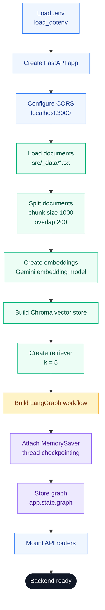
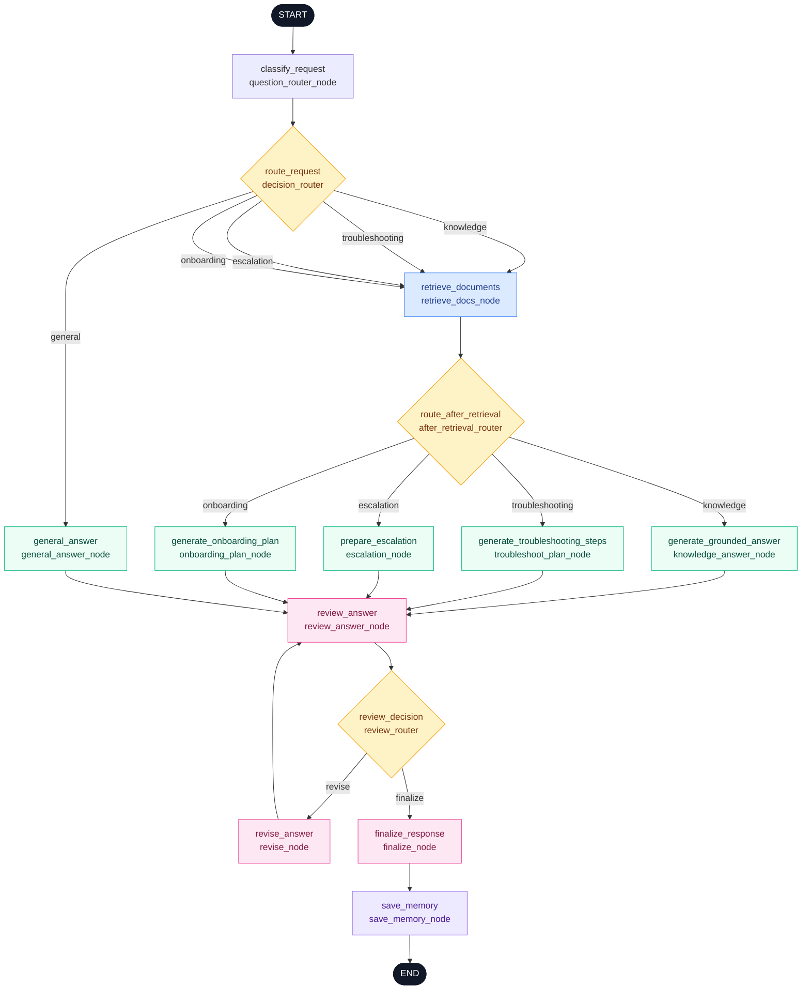

# Northstar CSA Architecture

## Purpose

Northstar CSA is a production-style AI customer support assistant for Northstar CRM. It is split into two applications:

- `northstar-backend`: FastAPI backend with LangGraph, RAG, memory, and support workflow logic.
- `northstar-frontend`: Next.js chat frontend that calls the backend and renders the support response.

The architecture is designed around one core idea: every customer message is classified into a support path, processed by the right graph branch, reviewed for quality and safety, finalized, saved to memory, and returned through a typed API response.

## High-Level System

```mermaid
flowchart LR
    Customer([Customer]) --> Frontend["Next.js frontend<br/>Chat UI"]
    Frontend --> API["FastAPI backend<br/>POST /v1/chat"]
    API --> Graph["LangGraph support workflow"]

    Graph --> Classify["classify request"]
    Classify --> Retrieve["retrieve documents<br/>when needed"]
    Retrieve --> Generate["generate branch-specific answer"]
    Generate --> Review["review answer"]
    Review --> Revise{"revision needed?"}
    Revise -->|yes| Generate
    Revise -->|no| Finalize["finalize response"]
    Finalize --> Memory["save memory"]
    Memory --> Response["typed API response"]
    Response --> Frontend
    Frontend --> Canvas["Markdown answer<br/>metadata panels"]

    classDef actor fill:#111827,color:#ffffff,stroke:#111827,stroke-width:1px;
    classDef frontend fill:#dbeafe,color:#1e3a8a,stroke:#3b82f6,stroke-width:1px;
    classDef api fill:#dcfce7,color:#14532d,stroke:#22c55e,stroke-width:1px;
    classDef graphNode fill:#fef3c7,color:#78350f,stroke:#f59e0b,stroke-width:1px;
    classDef decision fill:#fce7f3,color:#831843,stroke:#ec4899,stroke-width:1px;
    classDef memory fill:#ede9fe,color:#4c1d95,stroke:#8b5cf6,stroke-width:1px;

    class Customer actor;
    class Frontend,Canvas frontend;
    class API,Response api;
    class Graph,Classify,Retrieve,Generate,Review,Finalize graphNode;
    class Revise decision;
    class Memory memory;
```



## Backend Architecture

The backend lives in:

```text
northstar-backend/src/
```

Key modules:

```text
src/main.py
src/api/chat_route.py
src/api/health_route.py
src/graph/support_graph.py
src/schemas/chat_schema.py
src/schemas/graph_schema.py
src/services/doc_service.py
src/services/rag_service.py
src/services/llm_service.py
src/agents/tools.py
src/utils/constants_util.py
src/_data/
```

### Application Startup

`src/main.py` is responsible for bootstrapping the backend.

Startup sequence:

1. Load environment variables from `northstar-backend/.env`.
2. Create the FastAPI app.
3. Configure CORS for the frontend origin.
4. Load local knowledge-base documents from `src/_data`.
5. Split documents into chunks.
6. Create embeddings.
7. Build a Chroma retriever.
8. Build and compile the LangGraph workflow.
9. Store the graph on `app.state.graph`.
10. Mount API routers.

Important startup code path:



This means the retriever is ready before the first chat request is handled.

## API Architecture

### Chat Route

Primary endpoint:

```http
POST /v1/chat
```

Implemented in:

```text
northstar-backend/src/api/chat_route.py
```

The route:

1. Receives a `ChatRequest`.
2. Pulls the compiled graph from `req.app.state.graph`.
3. Invokes the graph with an initial `AgentState`.
4. Passes `thread_id` to LangGraph config for checkpointing.
5. Converts retrieved documents into frontend source cards.
6. Returns a structured `ChatResponse`.

Request shape:

```json
{
  "question": "What is included in the Pro plan?",
  "customer_id": "acct-123",
  "thread_id": "session-abc"
}
```

Response envelope:

```json
{
  "error": false,
  "errors": [],
  "data": {
    "question": "...",
    "customer_id": "...",
    "thread_id": "...",
    "route": "...",
    "answer": "...",
    "review": {},
    "confidence": 0.87,
    "priority": "normal",
    "assigned_team": "customer_success",
    "sources": [],
    "memory_updates": []
  },
  "message": "successful",
  "status": 200
}
```

### Health Routes

Current health-style routes:

```http
POST /v1
POST /v1/health
```

These return a standard service status payload.

## Schema Architecture

### Chat Schemas

Defined in:

```text
src/schemas/chat_schema.py
```

`ChatRequest` describes the API input:

- `question`
- `thread_id`
- `customer_id`

`ChatResponseData` describes the actual graph output returned to the frontend:

- question
- customer and thread identifiers
- selected route
- final answer
- review result
- confidence score
- support priority
- assigned team
- sources
- memory updates

`ChatResponse` wraps `ChatResponseData` in a consistent API envelope:

- `error`
- `errors`
- `data`
- `message`
- `status`

### Graph State

Defined in:

```text
src/schemas/graph_schema.py
```

`AgentState` is the shared state object passed through LangGraph nodes.

Core fields:

- `question`: latest customer message
- `customer_id`: stable customer/account identifier
- `thread_id`: conversation/session identifier
- `messages`: session-level message history
- `route`: selected graph route
- `documents`: retrieved documents
- `answer`: draft answer
- `review`: structured review result
- `revision_count`: number of revision attempts
- `confidence`: response confidence score
- `priority`: support priority
- `assigned_team`: team responsible for follow-up
- `sources`: source metadata
- `memory_updates`: facts or events to save
- `final_answer`: final response returned to the API

`ReviewResult` is a structured review object:

```text
score: int
passed: bool
feedback: str
```

## LangGraph Architecture

The graph is defined in:

```text
src/graph/support_graph.py
```

### Core Nodes

The workflow contains these nodes:

- `question_router_node`
- `retrieve_docs_node`
- `knowledge_answer_node`
- `onboarding_plan_node`
- `troubleshoot_plan_node`
- `escalation_node`
- `general_answer_node`
- `review_answer_node`
- `revise_node`
- `finalize_node`
- `save_memory_node`

### Graph Flow

The intended graph flow is:



### Routing

`question_router_node` asks the LLM to classify the user message into one of:

- `knowledge`
- `troubleshooting`
- `escalation`
- `onboarding`
- `general`

`decision_router` maps the selected route to the next graph node.

General questions go directly to `general_answer_node` because they do not require retrieval.

Document-dependent routes go through `retrieve_docs_node` first:

- knowledge
- onboarding
- troubleshooting
- escalation

After retrieval, `after_retrieval_router` sends the state to the correct branch node based on `state.route`.

### Why Retrieval Happens Before Multiple Branches

Knowledge, onboarding, troubleshooting, and escalation all may depend on documented Northstar CRM behavior.

Examples:

- Pricing answers need `pricing_and_billing.txt`.
- CSV troubleshooting needs `csv_import_guide.txt`.
- Email sync troubleshooting needs `email_sync_guide.txt`.
- Escalation answers need `escalation_policy.txt` and sometimes `security_policy.txt`.
- Onboarding plans need `onboarding_checklist.txt` and sometimes migration/import docs.

The retrieved documents are stored in `state.documents` and reused by:

- branch answer node
- review node
- revision node

The review and revision nodes do not retrieve again. They use the same documents already stored in graph state.

## Branch Architecture

### Knowledge Branch

Node:

```text
knowledge_answer_node
```

Purpose:

- answer product, pricing, billing, integration, plan-limit, and documentation questions
- use only retrieved context
- fallback when context is missing
- mention source documents when possible

Output:

- `answer`
- source information should be carried through state/API response

### Troubleshooting Branch

Node:

```text
troubleshoot_plan_node
```

Purpose:

- handle product issues that usually do not require immediate escalation
- identify likely issue category
- ask for missing details
- provide ordered troubleshooting steps
- include escalation criteria
- return Markdown answer text

Expected structured output from the LLM includes:

- issue category
- summary
- missing details
- troubleshooting steps
- when-to-escalate rules
- customer-facing Markdown answer
- escalation flag
- priority
- assigned team

State updates:

- `answer`
- `priority`
- `assigned_team`
- `memory_updates`

### Escalation Branch

Node:

```text
escalation_node
```

Purpose:

- handle urgent or sensitive cases
- assign priority
- assign support team
- recommend next steps
- produce safe escalation language
- list safe information a human team should collect

Examples:

- duplicate charge
- urgent login outage
- suspected unauthorized access
- business-critical email sync outage

State updates:

- `answer`
- `priority`
- `assigned_team`
- `memory_updates`

### Onboarding Branch

Node:

```text
onboarding_plan_node
```

Purpose:

- extract structured planning details
- calculate rollout timeline
- estimate account size
- identify missing information
- generate assumptions, checklist, risks, owners, and next actions
- return a Markdown onboarding plan

The onboarding node uses a two-step process:

1. Extract planning inputs from the user request.
2. Use tool outputs and retrieved docs to generate the plan.

Planning inputs include:

- users
- contacts
- companies
- deals
- start date
- target days

Tool outputs include:

- account size
- implementation complexity
- recommended rollout phases
- calculated deadline
- compressed timeline indicator

### General Branch

Node:

```text
general_answer_node
```

Purpose:

- answer safe general questions unrelated to Northstar CRM
- avoid retrieval
- avoid inventing Northstar CRM product details
- return concise Markdown

General responses should normally have:

- no documents
- no sources
- low priority
- customer success as fallback assigned team

## Retrieval Architecture

### Document Source

The local knowledge base lives in:

```text
northstar-backend/src/_data/
```

Documents include:

- product overview
- pricing and billing
- account access
- integrations
- troubleshooting
- escalation
- CSV import
- email sync
- security
- onboarding
- SLA/support hours

### Loading

`doc_service.py` loads each `.txt` file into a LangChain `Document`.

Each document includes:

```python
metadata={
    "source": filename
}
```

### Chunking

`rag_service.py` uses `RecursiveCharacterTextSplitter`.

Current settings:

```text
chunk_size = 1000
chunk_overlap = 200
```

### Embeddings

The backend uses Google Generative AI embeddings:

```text
models/gemini-embedding-001
```

### Vector Store

The backend uses Chroma.

The current implementation creates an in-memory Chroma store at startup.

### Retriever

The retriever returns five chunks:

```text
k = 5
```

These chunks become `state.documents`.

## LLM Architecture

The LLM service is defined in:

```text
src/services/llm_service.py
```

It supports Anthropic and Google/Gemini models.

Because different providers may return message content in different shapes, graph code should normalize LLM response content before:

- calling `.strip()`
- calling `.lower()`
- parsing JSON
- returning answer text

The safest pattern is:

```text
raw response -> normalize content to text -> parse/use text
```

This avoids provider-specific failures when content is returned as blocks instead of plain strings.

## Review and Revision Architecture

### Review Node

Node:

```text
review_answer_node
```

The review node checks:

- whether the answer addresses the question
- whether knowledge answers are grounded in retrieved context
- whether source references are present when needed
- whether the response avoids unsupported refund, legal, security, SLA, or engineering promises
- whether the answer is clear and actionable
- whether revision is needed

It produces:

- score
- passed flag
- feedback
- confidence

### Confidence

Confidence is calculated from:

- review score
- review pass/fail status
- whether documents exist for non-general routes
- whether sources exist when needed
- revision count

The frontend can show confidence as part of the review/status panel.

### Revision Node

Node:

```text
revise_node
```

The revision node improves the draft answer using:

- original question
- current answer
- retrieved context
- review feedback
- selected route

It increments `revision_count` and returns an updated `answer`.

### Finalization

Node:

```text
finalize_node
```

The finalization node decides what becomes `final_answer`.

If review passed, it usually copies:

```text
answer -> final_answer
```

If review failed after allowed revisions, it should return a cautious fallback rather than sending unsupported content.

## Memory Architecture

Northstar CSA uses both short-term and long-term memory.

### Short-Term Memory

Short-term memory is conversation/session memory.

Implemented with LangGraph checkpointing:

```python
checkpointer = MemorySaver()
graph = builder.compile(checkpointer)
```

The API passes `thread_id` into graph config:

```python
config={
    "configurable": {
        "thread_id": body.thread_id
    }
}
```

When the frontend sends the same `thread_id`, LangGraph can maintain session continuity.

Example:

```text
Customer: How do I import contacts from CSV?
Assistant: answers with CSV import guidance.
Customer: What if some rows fail?
Assistant: understands "rows" refers to CSV import.
```

### Long-Term Memory

Long-term memory stores stable facts keyed by `customer_id`.

Allowed fact fields:

- company type or industry
- plan tier
- team size
- preferred support tone
- active goal

The current store is in-memory:

```text
CUSTOMER_MEMORY_STORE
```

This is suitable for a capstone demo but not durable. A production version should use SQLite, Postgres, Redis, or another persistent store.

### Save Memory Node

Node:

```text
save_memory_node
```

Responsibilities:

1. Read proposed updates from `state.memory_updates`.
2. Filter for stable customer facts.
3. Validate allowed fields.
4. Save facts with sufficient confidence.
5. Clear `memory_updates`.
6. Append the final assistant message to state messages.

`memory_updates` is a staging area. It is not the long-term memory store itself.

## Frontend Architecture

The frontend lives in:

```text
northstar-frontend/src/
```

Important files:

- `src/app/page.tsx`
- `src/app/layout.tsx`
- `src/hooks/useChat.tsx`
- `src/services/axios.service.tsx`
- `src/utils/interfaces.util.tsx`
- `src/components/EmptyState.tsx`

### Page

`page.tsx` is the main chat screen.

It manages:

- input text
- loading state
- answer
- route
- review
- confidence
- priority
- assigned team
- sources
- memory updates
- customer ID
- thread ID

The answer is rendered as Markdown because backend branch prompts return Markdown-formatted customer messages.

### Chat Hook

`useChat.tsx` sends requests to the backend.

The hook posts:

```text
POST /v1/chat
```

with:

- question
- customer_id
- thread_id

### Axios Service

`axios.service.tsx` centralizes API calls.

It reads:

```text
NEXT_PUBLIC_API_URL
```

from the frontend `.env`.

Example:

```env
NEXT_PUBLIC_API_URL=http://localhost:8000
```

### ID Handling

The frontend should generate and reuse:

- `customer_id` for stable customer memory
- `thread_id` for session memory

The `uuid` package can generate these IDs. The IDs should be stored in `localStorage` and sent with every chat request.

## Source and Metadata Display

The frontend should display:

- `answer` as Markdown
- `route` as the selected path
- `confidence` as answer confidence
- `review` as QA status
- `priority` for operational cases
- `assigned_team` for escalation/follow-up
- `sources` as cards
- `memory_updates` for debug or memory visibility

This makes the app useful both as a customer chat and as a demo of the internal agent workflow.

## Design Tradeoffs

### In-Memory Vector Store

The current vector store is created at startup. This is simple for local development, but startup depends on embedding generation and will rebuild vectors every restart.

Production improvement:

- use persistent Chroma storage
- prebuild the index
- load the vector store on startup

### In-Memory Long-Term Memory

The current memory store resets when the server restarts.

Production improvement:

- persist memory to SQLite, Postgres, Redis, or another durable store

### LLM JSON Outputs

Several graph nodes ask the LLM to return JSON. Model output can include markdown fences or provider-specific content blocks.

Production improvement:

- use structured output APIs where available
- normalize LLM content before parsing
- validate with Pydantic models
- add fallback behavior for parse failures

### Review Node Reliability

The review node calls the LLM after answer generation. If the provider fails, the whole API can fail unless review errors are handled.

Production improvement:

- add fallback review results
- expose review failure clearly
- optionally retry transient provider errors

### Routing and Retrieval

Document-dependent routes should retrieve before answering. General questions should avoid retrieval so they return no sources.

The correct flow is:

```text
general -> general_answer_node
all other routes -> retrieve_docs_node -> branch answer node
```

## Deployment Notes

For local development:

```bash
cd northstar-backend
uv run uvicorn src.main:app --reload
```

```bash
cd northstar-frontend
npm run dev
```

For a production deployment, the following would need to be added:

- durable vector store
- durable memory store
- structured logging
- model retry policy
- secret management
- frontend/backend deployment config
- tests for all required support scenarios
